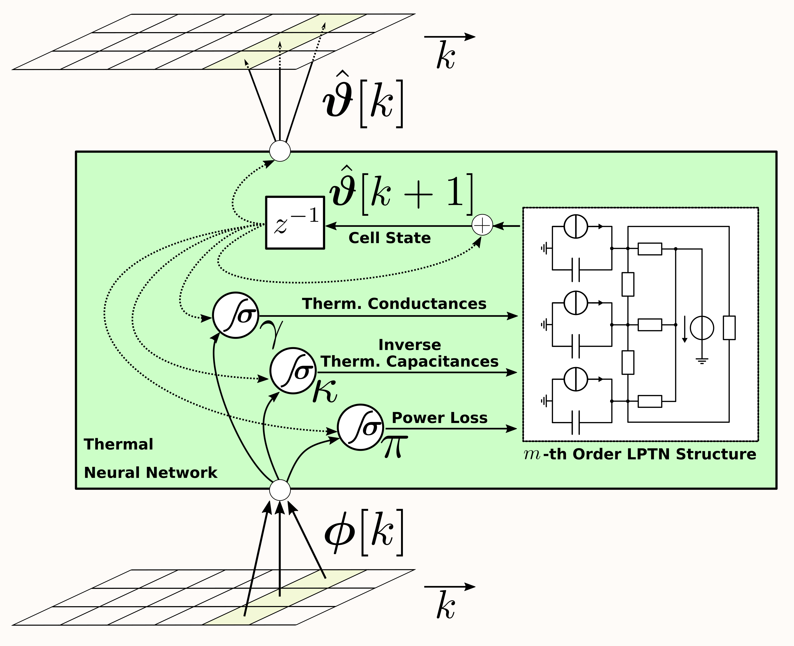

# Thermal Neural Networks
This repository demonstrates the usage of [thermal neural networks (TNNs)](https://doi.org/10.1016/j.engappai.2022.105537) on an electric motor data set.

## Topology



Three function approximators (e.g., multi-layer perceptrons (MLPs)) model the thermal characteristics of an arbitrarily complex component arrangement forming a system of interest.
One outputs thermal conductances, another the inverse thermal capacitances, and the last one the power losses generated within the components.

In contrast to other neural network architectures, a TNN needs at least to know which features are temperatures and which are not.
The TNN's inner cell working is that of [lumped-parameter thermal networks](https://en.wikipedia.org/wiki/Lumped-element_model#Thermal_systems) (LPTNs).
A TNN can be interpreted as a hyper network that is parameterizing an LPTN, which in turn is iteratively solved for the current temperature prediction.

In a nutshell, a TNN solves the difficult-to-grasp nonlinearity and scheduling-vector-dependency in [quasi-LPV](https://en.wikipedia.org/wiki/Linear_parameter-varying_control) systems, which an LPTN represents.

## Code Structure

The streamlined usage can be seen in the jupyter notebooks, one with tensorflow2 (TNN) and two with pytorch (TNN and NODE).
The tf2-version makes heavy use of auxiliary functions and classes declared in `aux`, whereas the pytorch notebooks are self-contained and do not import from 'aux'. 
In both frameworks, the TNN is defined as a cell class that is plugged into an outer RNN layer.

## Citing

The TNN is introduced in:
```
@article{kirchgaessner_tnn_2023,
title = {Thermal neural networks: Lumped-parameter thermal modeling with state-space machine learning},
journal = {Engineering Applications of Artificial Intelligence},
volume = {117},
pages = {105537},
year = {2023},
issn = {0952-1976},
doi = {https://doi.org/10.1016/j.engappai.2022.105537},
url = {https://www.sciencedirect.com/science/article/pii/S0952197622005279},
author = {Wilhelm Kirchgässner and Oliver Wallscheid and Joachim Böcker}
}
```

Further, this repository supports and demonstrates the findings around a TNN's generalization to [Neural Ordinary DIfferential Equations](https://arxiv.org/abs/1806.07366) as presented on [IPEC2022](https://www.ipec2022.org/index.html). 
If you want to cite that work, please use
```
@INPROCEEDINGS{kirchgässner_node_ipec2022,
  author={Kirchgässner, Wilhelm and Wallscheid, Oliver and Böcker, Joachim},
  booktitle={2022 International Power Electronics Conference (IPEC-Himeji 2022- ECCE Asia)}, 
  title={Learning Thermal Properties and Temperature Models of Electric Motors with Neural Ordinary Differential Equations}, 
  year={2022},
  volume={},
  number={},
  pages={2746-2753},
  doi={10.23919/IPEC-Himeji2022-ECCE53331.2022.9807209}}
```

The data set is freely available at [Kaggle](https://www.kaggle.com/wkirgsn/electric-motor-temperature) and can be cited as
```
@misc{electric_motor_temp_kaggle,
  title={Electric Motor Temperature},
  url={https://www.kaggle.com/dsv/2161054},
  DOI={10.34740/KAGGLE/DSV/2161054},
  publisher={Kaggle}, 
  author={Wilhelm Kirchgässner and Oliver Wallscheid and Joachim Böcker}, 
  year={2021}}
```
